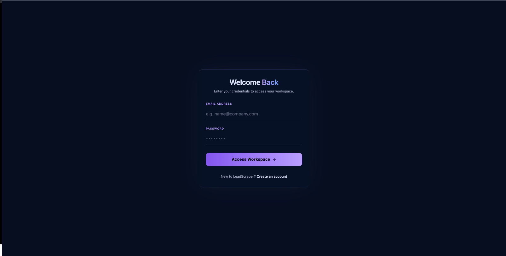
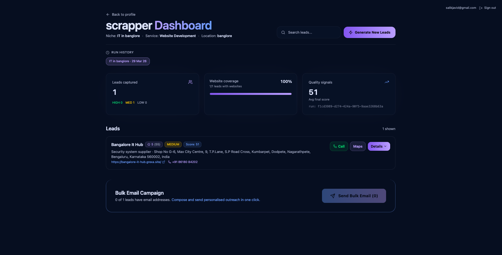

# Agentic AI Lead Scraper (Pipeline + Outreach)

An end-to-end lead generation prototype that:

1) takes a niche like **“pharmacies in srinagar kashmir”**
2) scrapes Google Maps businesses (+ reviews)
3) enriches websites (audit + service-specific signals)
4) scores + prioritizes leads with an LLM + rule-based signals
5) extracts contact emails
6) optionally sends outreach emails via **SendGrid**

The frontend is a **dark, glassy, gradient UI** (Tailwind + Vite + React) designed to feel like a modern “agent dashboard”.


---

## Folder Structure

### Backend (Python / Flask)

- `app.py` — Flask API (`/generate-leads`, `/services`, `/health`) + optional SendGrid dispatch
- `pipeline.py` — the main pipeline orchestration (parse niche → scrape → enrich → score → export `final_leads.json`)
- `services/`
  - `services/niche_parser.py` — parses free-text niche into `{industry, location}` (regex + Groq LLM fallback)
  - `services/query_generator.py` — generates diverse search queries (Groq LLM)
- Scrapers
  - `email_scraper_apify.py` — Google Maps scraping via Apify (business details + reviews + extracted emails)
  - `scraper_apify.py` — older Apify scraper (without email focus)
  - `scraper.py`, `scraperThreads.py` — legacy SerpAPI-based scrapers
- Enrichment + scoring
  - `enrichment.py` — service-aware website enrichment (audit / social & video presence checks)
  - `website_scraper.py` — page scraping (requests + Playwright fallback)
  - `evaluator.py` — website evaluation (LLM-based scoring; currently uses deprecated `google.generativeai`)
  - `lead_scorer.py` — Groq LLM lead scoring + “why approach / why not”
  - `service_configs.py` — service definitions + signal rules + LLM scoring contexts
  - `vector_scorer.py`, `vector_scoreHYBdrid.py` — experimental scoring approaches
- Database (Supabase)
  - `db/client.py` — lazy Supabase client (`get_supabase()`)
  - `db/insert.py` — push pipeline runs/leads into Supabase (`runs`, `leads`)
  - `push_to_db.py` — helper script (optional)
  - `server/test_insert.py` — quick insert test
- Email
  - `email_sender.py` — outbound email sending helpers

### Frontend (React / Vite / Tailwind)

- `client/`
  - `client/src/main.jsx` — app bootstrapping
  - `client/src/App.jsx` — routing + Supabase auth guard
  - `client/src/pages/`
    - `Home.jsx` — workspace initialization / profile inputs
    - `Profile.jsx` — profile configuration + “Generate Leads” action
    - `Dashboard.jsx` — lead list + metrics UI (renders pipeline output)
    - `Login.jsx`, `SignUp.jsx`, `Onboarding.jsx` — auth/onboarding UI
  - `client/lib/supabaseClient.jsx` — Supabase JS client

### Output Artifacts (generated)

- `data.json` — raw scraped leads
- `scored_leads.json` — intermediate scored dataset (optional)
- `final_leads.json` — final pipeline output (recommended for demo/showcase)
- `analyzed_data.json` — website analysis output (optional)

---

## Pipeline Overview (Backend)

The pipeline is service-aware: the same leads can be scored differently depending on the service you’re selling (website development, SEO, video creation, etc.).

### 1) Niche Parsing

Input: `"pharmacies in srinagar kashmir"`

- `services/niche_parser.py` extracts:
  - `industry`: `"pharmacies"`
  - `location`: `"srinagar kashmir"`

### 2) Query Expansion (optional)

`services/query_generator.py` generates multiple search variants to improve discovery.

### 3) Google Maps Scrape (Apify)

`email_scraper_apify.py` scrapes:
- business details (name, category, address)
- rating + review count
- Google Maps URL
- latest reviews (including negative reviews)
- website
- extracted emails (when available)

### 4) Website Enrichment

`enrichment.py` runs service-specific checks:
- for **website_development**: website audit + flaws + improvements
- for **video_creation**: checks social/video presence

### 5) LLM Scoring (Groq)

`lead_scorer.py` uses Groq to output:
- `llm_score` (0–100)
- `why_approach`
- `why_not`

### 6) Signals + Final Score

`pipeline.py` combines:
- `llm_score`
- `website_gap` (worse website → better lead)
- `signals_score` (rule-based; `service_configs.py`)

Final formula:

`final_score = 0.5 * llm_score + 0.3 * website_gap + 0.2 * signals_score`

Leads are classified into:
- `HIGH` (>= 70)
- `MEDIUM` (>= 40)
- `LOW` (< 40)

### 7) Output: `final_leads.json`

The output format is designed for easy UI rendering and outreach workflows:

- `meta` summarizes run context + counts
- `leads[]` contains enriched + scored leads, including `emails[]`

---

## API

### `POST /generate-leads`

Request:
```json
{
  "niche": "pharmacies in srinagar kashmir",
  "service_type": "website_development",
  "max_results": 20,
  "send_emails": true,
  "max_emails_total": 500,
  "max_emails_per_lead": 50
}
```

Response:
- pipeline output (`meta + leads[]`)
- optional `email_dispatch` summary (sent/failed, per-lead email status)

### `GET /services`
Returns available `service_type` values and labels.

### `GET /health`
Simple health check.

---

## Frontend Flow

1) **Login / Signup** (Supabase Auth)
2) **Home → Profile**: user enters workspace details + targeting
3) **Profile → Generate Leads**: triggers backend pipeline and optional email send
4) **Dashboard**: shows lead metrics + scored lead list for outreach

### UI Style (for Showcase)

The UI is intentionally built for demos:
- deep navy background (`#060e20`) with radial gradients
- glassmorphism panels (`backdrop-blur`, subtle borders)
- purple/blue accent gradient buttons
- compact, scannable cards + lists (agent “control panel” feel)

If you’re creating a showcase page/video, the most “hero” screens are:
- Login (welcome back card)
- Profile (configuration + “Generate Leads” CTA)
- Dashboard (metrics + prioritized lead list)

---

## Setup

### 1) Backend (Python)

Create env:
```bash
python3 -m venv venv
source venv/bin/activate
pip install -r requirements.txt
```

Run:
```bash
./venv/bin/python app.py
```

### 2) Frontend (Vite)

```bash
cd client
npm install
npm run dev
```

---

## Environment Variables

Copy `.env.example` → `.env` and fill:

- `GROQ_API_KEY` — Groq LLM for parsing + lead scoring
- `APIFY_API_TOKEN` — Apify actor token for Google Maps scraping
- `SENDGRID_API_KEY` — SendGrid API key
- `SENDGRID_FROM_EMAIL` — verified sender
- `SENDGRID_REPLY_TO` — reply-to address for outreach
- (Optional) Supabase DB push:
  - `SUPABASE_URL`
  - `SUPABASE_KEY`

---

## Upcoming Features

### AI Calling Agent (End-to-End Client Delivery)

Goal: close the loop from “lead discovered” → “lead contacted” → “meeting booked”.

Planned capabilities:
- **Call script generation** per lead (based on `why_approach`, website gaps, reviews)
- **Voice agent** that can place calls, qualify interest, handle objections
- **Automatic follow-ups** (email + WhatsApp/SMS)
- **Calendar booking** + CRM notes
- **Conversation summaries** pushed back into the dashboard

This turns the project from “lead scraper” into a full **agentic outbound system** for agencies.

---

## Notes / Known Limitations

- `evaluator.py` currently uses the deprecated `google.generativeai` library; it should be migrated to `google.genai`.
- Google Maps scraping depends on the Apify actor availability and your account limits.
- Sending emails in bulk can trigger deliverability/rate-limit issues; use SendGrid verified domains and warm-up best practices.
